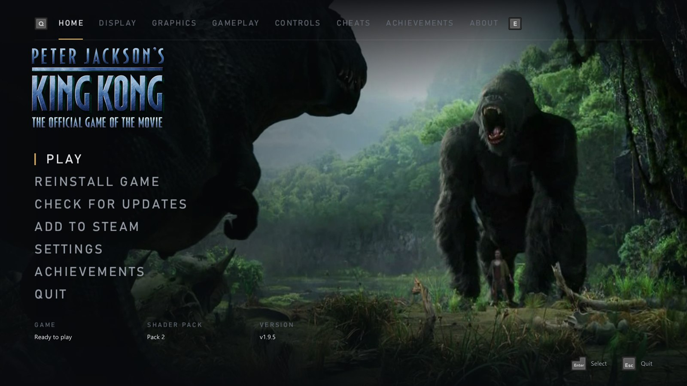
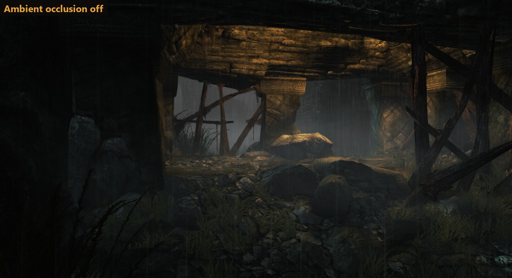
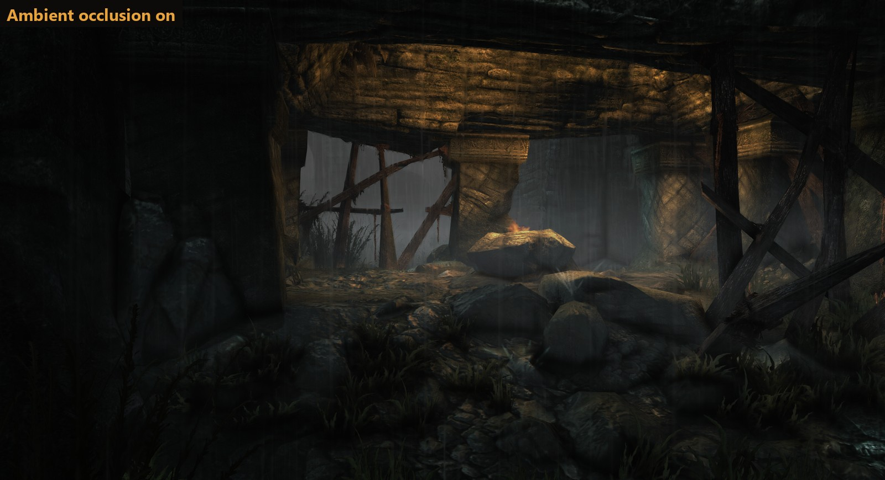
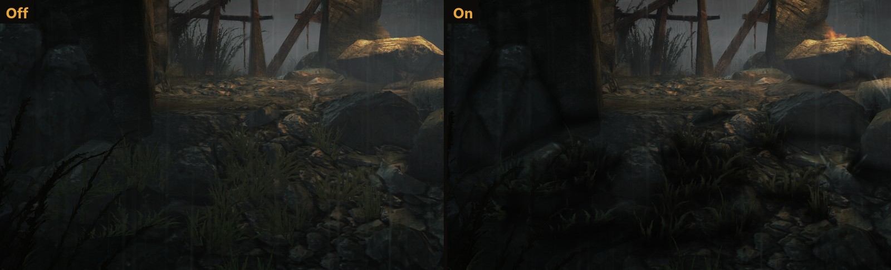
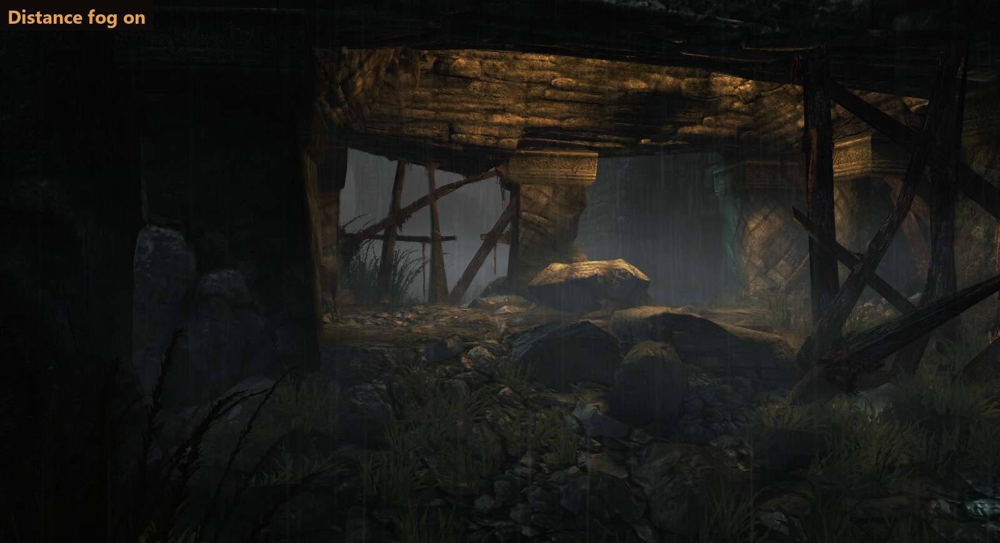
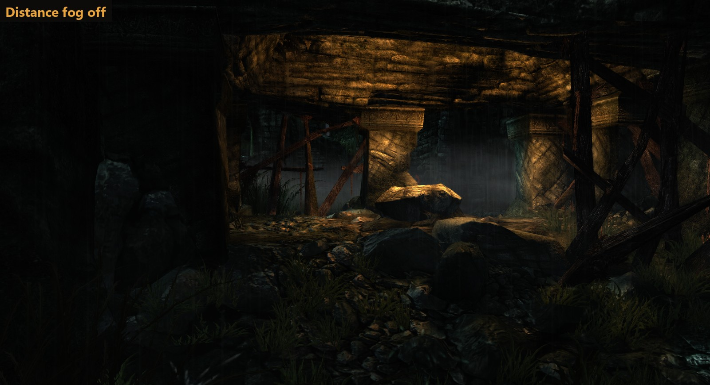
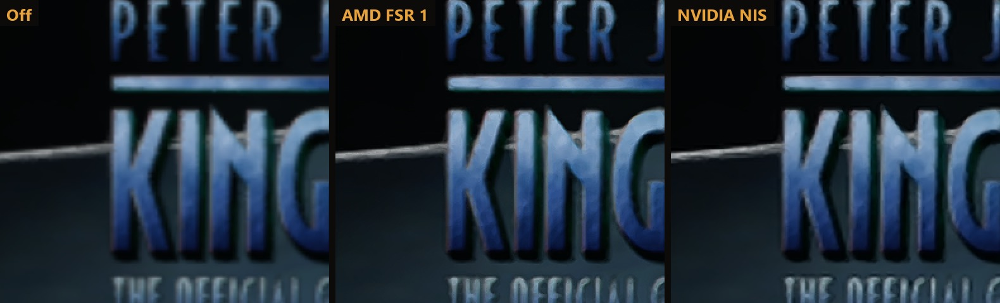
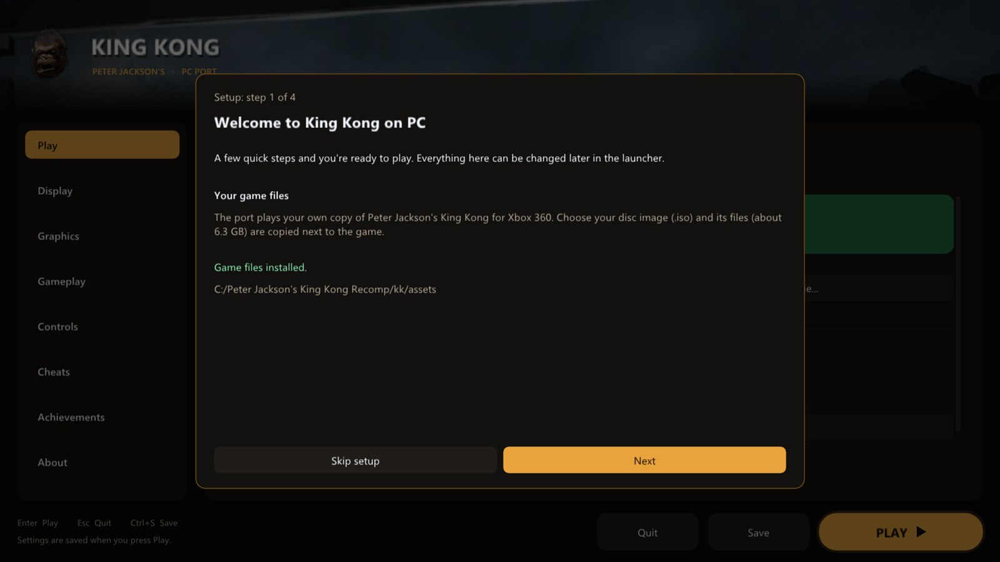
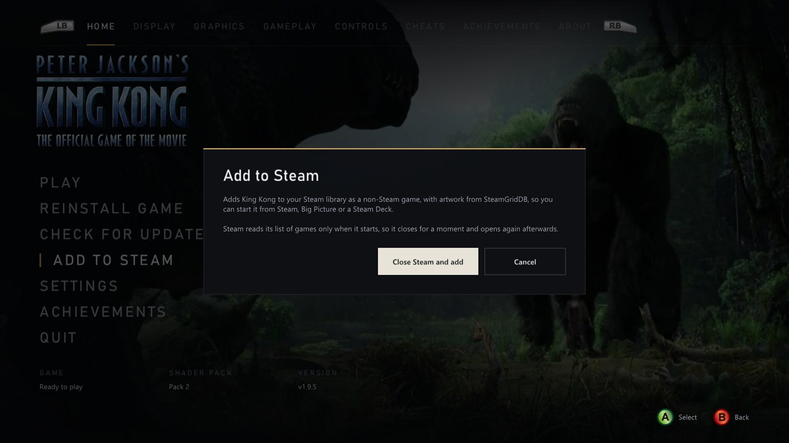

<div align="center">


<br>

[](https://github.com/TekRantGaming/king-kong-recompiled/releases/latest)
[](https://github.com/TekRantGaming/king-kong-recompiled/releases)

[](https://quiverlauncher.com/apps/peter-jackson-s-king-kong-the-official-game-of-the-movie-king-kong-pc-port)

### Peter Jackson's King Kong on PC, running natively, with the launcher and options of a modern PC release.

[](https://github.com/TekRantGaming/king-kong-recompiled/releases/latest)

<sub>The original Xbox 360 game code, translated to native PC code with the <a href="https://github.com/rexglue/rexglue-sdk">ReXGlue SDK</a>. <b>No game files included</b>: bring your own copy of the King Kong Xbox 360 disc.</sub>

</div>

<br>

> [!NOTE]
> **In active development.** Every chapter has been started and played for a while by automated test runs, but a full play-through hasn't been confirmed yet. New versions come out often, and the launcher offers each one when it opens. Please report anything that goes wrong.

## Highlights

<table>
<tr>
<td width="33%" valign="top">

**Plays past the freeze**<br>
On Xenia this game gets stuck at the start, staring at the word "VENTURE". This port fixes it, with working music and voice lines.

</td>
<td width="33%" valign="top">

**Up to 8K**<br>
Render at up to 7680 x 4320, with presets from Supersample to Ultra Performance that match your screen.

</td>
<td width="33%" valign="top">

**Your frame rate**<br>
30 fps by default, just like the Xbox 360. Go up to 240 or unlimited if you want it smoother (see known issues).

</td>
</tr>
<tr>
<td valign="top">

**Xbox 360 style achievements**<br>
A pop-up with a sound every time you unlock one of the game's 9 achievements, just like the console. Choose the sound in the launcher.

</td>
<td valign="top">

**Your controls, your way**<br>
Invert the camera, set its sensitivity, toggle aim, set a deadzone, remap any button, adjust vibration, or play with keyboard and mouse.

</td>
<td valign="top">

**Install from your disc**<br>
Download, run, pick your disc image in the launcher, and play. No technical steps.

</td>
</tr>
<tr>
<td valign="top">

**A wider view**<br>
Widen the field of view from the original 69° up to 110°. Jack's gun keeps its usual size, and nothing pops in at the edges.

</td>
<td valign="top">

**Cheats as switches**<br>
All ten of the game's cheats are switches in the launcher, so there's no typing codes every time you play.

</td>
<td valign="top">

**Always up to date**<br>
The launcher offers new versions when it opens and shows you what changed. The newest shader pack downloads by itself.

</td>
</tr>
<tr>
<td valign="top">

**Ambient occlusion**<br>
Soft shading in corners and creases and under rocks, grass and people, that stays under the game's fog. About 1 ms a frame at 4K.

</td>
<td valign="top">

**AMD FSR 1 and NVIDIA NIS**<br>
Two upscalers for any graphics card, each with Native, Quality, Balanced and Performance modes, to keep a lower resolution sharp.

</td>
<td valign="top">

**Original or Modern**<br>
Play it exactly as the Xbox 360 did with one click, or pick a preset from Low to Ultra, or one made for the Steam Deck.

</td>
</tr>
<tr>
<td valign="top">

**A launcher made for controllers**<br>
Set everything up from the couch with a controller, or use the keyboard and mouse. The button pictures match your controller.

</td>
<td valign="top">

**Add to Steam**<br>
One click puts it in your Steam library with its artwork, ready for Big Picture and the Steam Deck, with your controller still working.

</td>
<td valign="top">

**Looks and sounds like the game**<br>
The launcher takes the logo, stills from the movie, the menu music and the menu sounds from your own copy of the game.

</td>
</tr>
</table>

## New in v1.9.7

**Keyboard and mouse, done properly.** Real mouse look (the same movement always turns the camera the same amount, as in other first-person games), a modern layout (left mouse button shoots, right mouse button aims, R reloads, WASD moves), mouse buttons you can bind, and choosing **Keyboard & mouse** now switches the game's prompts to your keys and turns the mouse camera on. More in [Controls](#controls).

## New in v1.9.6

**Play on Linux and Steam Deck now**, with an **experimental Proton build**: the Windows download running through Steam's Proton (see [Linux and Steam Deck](#linux-and-steam-deck-experimental)). This is not native Linux support; a native Linux version is in development and will come in a future update. Also fixed: the game could freeze on the black loading screen as the main menu loads.

## New in v1.9.5

A new launcher, rebuilt from scratch. It works fully with a controller, and it looks and sounds like the game: the King Kong logo over stills from the movie trailer, the main menu music and the game's menu sounds, all taken from your own copy. **Add to Steam** puts the port in your Steam library with its artwork in one click. More in [The launcher](#the-launcher).



## New in v1.9.0

Ambient occlusion, two upscalers, graphics presets, the Original Xbox 360 look and a switch for the distance fog, all on the launcher's **Graphics** page. The game shots below are from the V-Rex chapter; in each pair only the setting being compared changes.

### Ambient occlusion

Soft shading where surfaces meet: in corners and creases, and on the ground under rocks, grass and people, so they sit in the scene instead of floating on it. It stays under the game's own distance fog, so far-off walls don't show through the haze. It's off by default: turn it on with **Ambient occlusion**, at strength 1 (recommended), 2 or 3. It costs about 1 ms a frame at 4K, and works with NVIDIA and AMD graphics for now.

<table>
<tr>
<td width="50%"></td>
<td width="50%"></td>
</tr>
</table>



<sub>2560 x 1440 at strength 1, taken half a second apart (the rain and the firelight move in between). The close-up is at full size.</sub>

### Distance fog

**Distance fog** is on by default. Off clears the haze over far scenery, though the fog is part of Skull Island's look and also hides the edges of each area, so some empty backdrops can show.

<table>
<tr>
<td width="50%"></td>
<td width="50%"></td>
</tr>
</table>

### AMD FSR 1 and NVIDIA Image Scaling

Pick **AMD FSR 1** or **NVIDIA NIS** under **Upscaler**. Both work on any graphics card. They scale the game's picture up to your screen and sharpen it, so drawing fewer pixels for a higher frame rate still looks crisp. **Upscaler mode** picks how many pixels the game draws: **Native**, **Quality**, **Balanced** or **Performance**, with the resolution shown for your screen. The game draws in steps of its original 720p, so some modes come out the same on some screens.



<sub>The title screen at 1920 x 1080 in Performance mode (drawn at 1280 x 720), zoomed 2x: plain scaling, AMD FSR 1 and NVIDIA NIS.</sub>

### Original Xbox 360 or Modern, and presets

**Look** at the top of the **Graphics** page switches between **Original Xbox 360**, the game as it was on the console (720p at 30 FPS, its own anti-aliasing and texture filtering, the 69° field of view, motion blur and fog, no ambient occlusion and no upscaler), and **Modern**, with every setting. Switching back to Modern puts your own settings back. In Modern, a **Preset** sets several things at once:

| Preset | Upscaler | Render quality | Anti-aliasing | Texture filtering | Ambient occlusion |
| --- | :---: | :---: | :---: | :---: | :---: |
| Low | AMD FSR 1 | Performance | FXAA | 2x | off |
| Medium (default) | off | Native | FXAA | 4x | off |
| High | off | Native | FXAA | 8x | on |
| Ultra | off | Supersample | FXAA Extreme | 16x | on |
| Steam Deck | off | Native | FXAA | 2x | off |

Change any of them yourself and the preset shows **Custom**.

## Why this port?

*Peter Jackson's King Kong: The Official Game of the Movie* came out in 2005 on PC and on every console of the time. The Xbox 360 version was a launch title for the console, with upgraded graphics and its own achievements.

Until now the only way to play it was on an Xbox 360. On the Xenia emulator it boots, but it gets stuck right at the start of the first level and can't be played. This port runs it natively on Windows, fixes that freeze, and adds the options you would expect from a PC release.

## The launcher

Everything is set up before the game starts, with a controller, the keyboard or the mouse. The launcher looks and sounds like the game, using your own copy of it: the King Kong logo, stills from the movie trailer, the main menu music and the game's own menu sounds. Nothing from the game comes in the download. It follows the game's **Language** setting (English, French, German, Spanish or Italian). Settings are saved to a plain text file, `king_kong.toml`, next to the game, and every settings page has **Reset page** to put just that page back to its defaults.

<table>
<tr>
<td width="55%"></td>
<td valign="middle">

### Home
- **Play**, with the game's logo over a slow slideshow of stills from the movie
- **Reinstall** the game from your disc image, with a progress bar
- **Check for updates**: a new version downloads on its own screen with a progress bar, then the launcher restarts
- **Add to Steam** (see below)
- How the game, the **shader pack** and the port's version stand, at a glance
- Turn the launcher off and **hold Shift** at start to bring it back

</td>
</tr>
<tr>
<td valign="middle">

### First start
- The launcher asks for **your copy of the game** first: pick your disc image and it checks it really is King Kong, then installs it
- It takes its **artwork** from your copy, then opens on Home
- Choose your **language** before you start

</td>
<td width="55%"></td>
</tr>
<tr>
<td></td>
<td valign="middle">

### Add to Steam
- Adds the port to your **Steam library** as a non-Steam game, so you can start it from Steam, Big Picture or a **Steam Deck**
- With its **artwork** from [SteamGridDB](https://www.steamgriddb.com/game/5249080): cover, banner, header, logo and icon
- **Steam Input** is switched off for it, so your controller keeps working
- Steam closes for a moment while it's added and opens again afterwards

</td>
</tr>
<tr>
<td valign="middle">

### Display
- **Windowed** or **fullscreen**
- **Window size** that fits your screen
- **Choose the monitor**
- **VSync** on or off (off by default, and great with G-Sync and FreeSync)
- **Keep 16:9** with borders, or **stretch** to fill

</td>
<td></td>
</tr>
<tr>
<td></td>
<td valign="middle">

### Graphics
- **Look**: Original Xbox 360 (720p at 30 FPS, the console's anti-aliasing, texture filtering and field of view, motion blur and fog, no ambient occlusion) or Modern. Switching back to Modern puts your own settings back
- **Graphics presets**: Low and Medium (with FSR 1), High, Ultra and Steam Deck, or Custom when you set things yourself
- **Upscaler**: AMD FSR 1 (at Quality by default) or NVIDIA Image Scaling (NIS), both for any graphics card, or Off. Each has Native, Quality, Balanced and Performance modes, showing the resolution the game draws at; they scale the picture to your screen and sharpen it
- **Render quality** presets (with the upscaler off): Supersample, Native, Quality, Balanced, Performance and Ultra Performance, each showing the real resolution
- **Custom resolution** from 1x (720p) to 6x (8K)
- **FXAA** (on by default) and **FXAA Extreme**
- **Texture filtering** up to 16x (4x by default)
- **Motion blur** on or off (off by default): Off removes the ghost trail the game blends over fast moments, mostly in Kong's sequences
- **Screen blur** on or off (off by default): some levels (Necropolis, Brontosaurus) blur the whole picture slightly, sized for the Xbox 360's 720p, which makes them look low resolution on a sharper screen
- **Distance fog** on or off (on by default): Off clears the haze over far scenery, though it can show empty backdrops at the edges of an area
- **Ambient occlusion** (off by default): soft shading where surfaces meet, in corners and creases and under rocks, grass and people, at strength 1 (recommended), 2 or 3. About 1 ms a frame at 4K; NVIDIA and AMD graphics for now

</td>
</tr>
<tr>
<td valign="middle">

### Gameplay
- **Frame rate**: 30 (default, like the console), 60, 90, 120, 144, 165, 240 or unlimited
- **Field of view** from 69° (the original) to 110°. The game draws the wider area too, Jack's gun keeps its usual size, and the menus keep their original look
- **Language** of the game and the launcher
- **Frame counter** in the corner, toggled with <kbd>F2</kbd>
- **Startup logos**: skip the Ubisoft, Universal and WingNut movies (the default) or play them

</td>
<td></td>
</tr>
<tr>
<td></td>
<td valign="middle">

### Controls
- **Invert the camera** left/right and up/down, separately
- **Controller sensitivity** from 25% to 300% (150% by default), for looking left and right and up and down
- **Camera response**: Modern (the default) turns the camera the same way in every direction; Original is the Xbox 360's own feel
- **Real mouse look** for keyboard and mouse: the same movement always turns the camera the same amount, with **Mouse sensitivity** and **Mouse vertical** (invert)
- **Toggle aim**: press the left trigger once to raise the gun and again to lower it, instead of holding it
- **Stick deadzone** to stop drift (5% by default)
- **Vibration** on or off, with a strength slider
- **Remap any button** on your controller
- **Keyboard and mouse** play with a modern layout (left mouse button shoots, right mouse button aims, R reloads, WASD moves); rebind any control to a key or mouse button, and each one says what it does in the game
- **Button prompts** for Xbox 360, Xbox Series, PlayStation 5, PlayStation 2 or your keyboard keys, in the game and in the launcher

</td>
</tr>
<tr>
<td valign="middle">

### Cheats
The game's own cheats, as switches instead of codes to type each time you play:
- **All chapters** and **all bonus content**
- **Fast healing**, **one-hit kills**, **999 bullets** and **unlimited spears**
- The **revolver**, **machine gun**, **shotgun** and **sniper rifle**

They switch on as soon as the game reaches its main menu, exactly as if you had typed their codes.

</td>
<td></td>
</tr>
<tr>
<td></td>
<td valign="middle">

### Achievements
- All **9 achievements** with their pictures, descriptions and gamerscore
- See which ones you have **unlocked**
- Turn **pop-ups** and their **sound** on or off, set the volume
- **Pick the sound**: the built-in chime or any `.wav` you put in the `sounds` folder. Name the Xbox 360 sound `Xbox_360.wav` and it plays by default
- A **test button** to see and hear it
- A bonus **Welcome to Skull Island** achievement the first time you play

</td>
</tr>
<tr>
<td valign="middle">

### About
- The **version history**: the notes for every version
- The launcher's **music** and **menu sounds**, each with a volume slider
- **Check for updates** now, or turn the check at start off
- How the **shader pack** stands
- Open your **save folder**, **game folder** or **settings file** in one click
- Take the launcher's **artwork** from your copy again
- **Reset** every setting

</td>
<td></td>
</tr>
<tr>
<td></td>
<td valign="middle">

### What's new
- After an update, the launcher shows **what changed** the first time it opens
- **Every version** takes you to the full version history

</td>
</tr>
</table>

## In game

<div align="center">

<sub>The main menu.</sub>
</div>

<br>

<table>
<tr>
<td width="50%"></td>
<td width="50%"></td>
</tr>
<tr>
<td></td>
<td></td>
</tr>
</table>

### Xbox 360 vs PC port

| | Xbox 360 | PC port |
| --- | :---: | :---: |
| Resolution | 1280 x 720 | up to 7680 x 4320 |
| Frame rate | 30 fps | 30 fps, or up to 240 and unlimited |
| Anti-aliasing | console (2x MSAA) | console 2x MSAA plus FXAA, or higher resolutions |
| Upscaling | console | AMD FSR 1 or NVIDIA Image Scaling, four modes each |
| Texture filtering | console | up to 16x |
| Display | TV | windowed or fullscreen, any monitor |
| Controls | Xbox 360 controller | any controller, remapping, keyboard and mouse |
| Camera | game options | field of view, inverted axes, sensitivity, deadzone |
| Motion blur | always on | on or off |
| Screen blur (some levels) | always on | on or off |
| Distance fog | always on | on or off |
| Ambient occlusion | none | optional, three strengths |
| Graphics presets | none | Original Xbox 360 look, Low to Ultra, Steam Deck |
| Startup logos | always play | play or skip |
| Cheats | typed as codes each time | switches in the launcher |
| Achievement pop-ups | console | Xbox 360 style, with your choice of sound |

### Hotkeys

| Key | Action |
| --- | --- |
| <kbd>F2</kbd> | frame counter |
| <kbd>F3</kbd> | performance overlay |
| <kbd>F7</kbd> | achievements overlay |
| <kbd>Shift</kbd> while starting | open the launcher |

### Known issues

- Above 30 fps some character animations are not right yet. For example, the crew rowing at the start skip part of their animation. 30 fps, the default, plays them correctly.
- There can be a short pause when the game loads the next area. The game does the same on the Xbox 360.
- The pre-rendered videos pause for a moment every couple of seconds while the video player keeps to the video's timing. This is being looked into.
- Under Proton the launcher has no stills from the movie trailer (Proton can't play the trailer to it). It shows the title screen from your first play instead.
- The first time you see a new effect it has to be prepared. Many are prepared at once in the background and the game waits only a moment for them, so there are no long pauses, but an object can occasionally appear a moment late the first time. Effects are saved, so this only happens once, and the **shader pack** prepares the effects other play-throughs have already seen before you play.

### The shader pack

The game prepares each new effect (a shader) the first time it appears, which can cause a short pause. The shader pack is the list of effects collected by playing through the game, published on the [shader-packs release](https://github.com/TekRantGaming/king-kong-recompiled/releases/tag/shader-packs). You don't need to do anything to get it: each time the launcher opens, it downloads the newest pack if you don't have it yet and adds it to your shader cache (`Documents\king_kong\cache`), keeping anything your game has already prepared. The Home screen shows how it went. If you press **PLAY** while a download is still going, the game starts as soon as it finishes. Each time the game starts it prepares everything in the cache, so the parts of the game the pack covers don't pause even on a first play-through. New packs come out as more of the game is covered.

### Updates

When the launcher opens it asks GitHub whether a newer version of the port is out. **Update now** downloads it,
replaces the port's own files and restarts the launcher; your installed game, saves and settings stay as they are. Turn
the check off on the **About** page. The shader pack updates itself on its own (see **The shader pack**).

### Reporting a problem

Everything useful is in the `logs` folder next to `king_kong.exe`:

- `king_kong.log` describes your settings, and every 10 seconds it notes the frame rate, the 1% low and any frames that took over 50 or 100 ms. That shows exactly where stutter happens.
- If the game crashes, `crash-<date>.txt` and `crash-<date>.dmp` appear next to it.

Please attach them to an [issue](https://github.com/TekRantGaming/king-kong-recompiled/issues) together with your CPU, graphics card and the resolution you play at.

## Which version you need

The port is made for this disc only. Other versions will not work.

| | |
| --- | --- |
| Game | Peter Jackson's King Kong: The Official Game of the Movie |
| Disc | Xbox 360, USA and Europe (English, French, German, Spanish, Italian, Dutch, Swedish, Norwegian, Danish, Finnish) |
| Title ID | `555307D3` |
| Game version | `0.0.0.1` (the original disc release) |
| Disc image | `.iso`, 7,834,892,288 bytes |
| SHA-1 | `075F43709E9C9A095E099AB5056CC04B768288D1` |
| MD5 | `35D671ED4E9EAD9E6B288A3441B6C8F9` |

The launcher checks the title ID before it installs. To check your disc image yourself, run this in PowerShell and compare the result with the SHA-1 above:

```powershell
Get-FileHash "C:\Games\King Kong.iso" -Algorithm SHA1
```

## Getting started

**You need:** Windows 10 or 11 (64-bit), a graphics card with DirectX 12, about 7 GB of free space, and your own Peter Jackson's King Kong Xbox 360 disc as a disc image (see [Which version you need](#which-version-you-need)).

1. Download the **KingKong-...-windows-x64.zip** file from the [latest release](https://github.com/TekRantGaming/king-kong-recompiled/releases/latest) and unzip it anywhere.
2. Run **king_kong.exe**. The launcher opens, and the shader pack downloads by itself.
3. Choose **Select disc image** and pick your King Kong disc image. The launcher checks it, copies the game files (about 6.3 GB) into a `game` folder next to the exe and takes its artwork from them.
4. Press **PLAY**.

The download contains only this port. **No game files are included**: they come from your own disc. Your saves and settings are kept in `Documents\king_kong`.

**Quiver Launcher:** the port is also listed on [Quiver Launcher](https://quiverlauncher.com/apps/peter-jackson-s-king-kong-the-official-game-of-the-movie-king-kong-pc-port), where you can find it alongside other PC ports and see how it runs for other players.

### Linux and Steam Deck (experimental)

**This is an experimental Proton build, not native Linux support.** It's the Windows download running through Steam's **Proton**, so Linux and Steam Deck players can play now. A native Linux version is in development and will come in a future update. The Proton build was tested on a ROG Ally (Z1 Extreme) with Bazzite, where it held 120 FPS on the 10 W power profile.

1. Unzip **KingKong-...-windows-x64.zip** anywhere, for example in your home folder.
2. In Steam (in desktop mode on a Steam Deck), choose **Games > Add a Non-Steam Game to My Library**, browse to **king_kong.exe** and add it.
3. Right-click it in your library, choose **Properties > Compatibility**, tick **Force the use of a specific Steam Play compatibility tool** and pick **Proton Experimental**.
4. Start it from Steam (Game Mode works too). The first start takes about half a minute while Steam sets Proton up for it. Pick your disc image as on Windows: your Linux home folder is on the **Z:** drive.

Your saves and settings are kept in Steam's Proton folder for the game, under `steamapps/compatdata`.

**Native Linux:** in development, and coming in a future update. A native build already runs the launcher on Linux, but its renderer still draws some scenes wrong (black screens in some chapters), so until that's fixed, Proton is the way to play on Linux.

<details>
<summary><b>Building from source (for developers)</b></summary>

You need Visual Studio 2022 Build Tools with Clang, CMake and Ninja.

```powershell
.\setup.ps1 -Iso "C:\Games\King Kong.iso"   # downloads the SDK, unpacks your disc, translates the code
kk\build.bat kk-release                      # compiles
```

The finished game is in `kk\out\build\kk-release`. `Build King Kong.bat` does all of this in one go and puts the result in a `KingKong` folder. Point the game at your files with `--game_data_root`, or keep them in a `game` folder next to the exe.

For testing, `kk\build.bat kk-dev` builds a version with developer aids that release builds leave out. Set `KK_DEV_AUTOSKIP=1` and it presses through the intros, menus and story videos into gameplay on its own, logging `KK dev: gameplay reached`. Add `KK_DEV_WANDER=1` to keep walking and looking around after that. The shader pack is built by running every chapter this way with its own `--cache_root`, then `python tools/make_shader_pack.py <version> <out> <cache folders...>`.

</details>

## The "VENTURE" freeze

On Xenia this game gets stuck at the start, looking at the ship's name "VENTURE" ([xenia-project/game-compatibility#1302](https://github.com/xenia-project/game-compatibility/issues/1302)). The cause is how disc reads finish. The game streams music and voice lines with reads it expects to finish right away. The emulator finishes them but reports them as still in progress, so the game thinks it got no data. No voice line ever plays, and the opening waits forever for one to end.

This port finishes those reads the way the console does (`kk/src/io_fix.cpp`), so music, voice lines and the opening all work.

## Credits

- **Peter Jackson's King Kong: The Official Game of the Movie** by Ubisoft Montpellier, published by Ubisoft in 2005.
- Button prompt pictures from [**Xelu's Free Controllers & Keyboard Prompts**](https://thoseawesomeguys.com/prompts/) (CC0).
- [**ReXGlue SDK**](https://github.com/rexglue/rexglue-sdk), which does the code translation and runs the game, built on the work of [**Xenia**](https://github.com/xenia-project/xenia) and [**XenonRecomp**](https://github.com/hedge-dev/XenonRecomp).
- Upscaling: [**AMD FidelityFX Super Resolution 1**](https://github.com/GPUOpen-Effects/FidelityFX-FSR) (in the ReXGlue SDK) and the [**NVIDIA Image Scaling SDK**](https://github.com/NVIDIAGameWorks/NVIDIAImageScaling), both MIT licensed.

> [!NOTE]
> **AI disclosure:** this port was made almost entirely with Claude Code (Anthropic). The repository owner directed and tested the work; the AI did the analysis, code, tools and documentation.

> [!IMPORTANT]
> This project is not affiliated with or endorsed by Ubisoft, Universal Studios, WingNut Films, Microsoft or Xbox. It contains no game code or assets (the button prompt pictures are free CC0 art, not taken from the game). Do not open issues asking for game files.
