<div align="center">

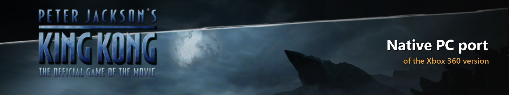

<br>

[](https://github.com/TekRantGaming/king-kong-recompiled/releases/latest)
[](https://github.com/TekRantGaming/king-kong-recompiled/releases)


### Peter Jackson's King Kong on PC, running natively, with the launcher and options of a modern PC release.

[](https://github.com/TekRantGaming/king-kong-recompiled/releases/latest)

<sub>The original Xbox 360 game code, translated to native PC code with the <a href="https://github.com/rexglue/rexglue-sdk">ReXGlue SDK</a>. <b>No game files included</b>: bring your own copy of the King Kong Xbox 360 disc.</sub>

</div>

<br>

> [!NOTE]
> **In active development.** Every chapter has been started and played for a while by automated test runs, but a full play-through hasn't been confirmed yet. New versions come out often, and the launcher offers each one when it opens. Please report anything that goes wrong.

## Highlights

<table>
<tr>
<td width="33%" valign="top">

**Plays past the freeze**<br>
On Xenia this game gets stuck at the start, staring at the word "VENTURE". This port fixes it, with working music and voice lines.

</td>
<td width="33%" valign="top">

**Up to 8K**<br>
Render at up to 7680 x 4320, with presets from Supersample to Ultra Performance that match your screen.

</td>
<td width="33%" valign="top">

**Your frame rate**<br>
30 fps by default, just like the Xbox 360. Go up to 240 or unlimited if you want it smoother (see known issues).

</td>
</tr>
<tr>
<td valign="top">

**Xbox 360 style achievements**<br>
A pop-up with a sound every time you unlock one of the game's 9 achievements, just like the console. Choose the sound in the launcher.

</td>
<td valign="top">

**Your controls, your way**<br>
Invert the camera, set its sensitivity, toggle aim, set a deadzone, remap any button, adjust vibration, or play with keyboard and mouse.

</td>
<td valign="top">

**Install from your disc**<br>
Download, run, pick your disc image in the launcher, and play. No technical steps.

</td>
</tr>
<tr>
<td valign="top">

**A wider view**<br>
Widen the field of view from the original 69° up to 110°. Jack's gun keeps its usual size, and nothing pops in at the edges.

</td>
<td valign="top">

**Cheats as switches**<br>
All ten of the game's cheats are switches in the launcher, so there's no typing codes every time you play.

</td>
<td valign="top">

**Always up to date**<br>
The launcher offers new versions and new shader packs when it opens, and shows you what changed.

</td>
</tr>
</table>

## Why this port?

*Peter Jackson's King Kong: The Official Game of the Movie* came out in 2005 on PC and on every console of the time. The Xbox 360 version was a launch title for the console, with upgraded graphics and its own achievements.

Until now the only way to play it was on an Xbox 360. On the Xenia emulator it boots, but it gets stuck right at the start of the first level and can't be played. This port runs it natively on Windows, fixes that freeze, and adds the options you would expect from a PC release.

## The launcher

Everything is set up before the game starts. The launcher uses art from your own copy of the game: Kong's face, the achievement pictures and the stormy sky from the game's menu. Settings are saved to a plain text file, `king_kong.toml`, next to the game, and every settings page has a **Reset page** button that puts just that page back to its defaults.

<table>
<tr>
<td width="55%">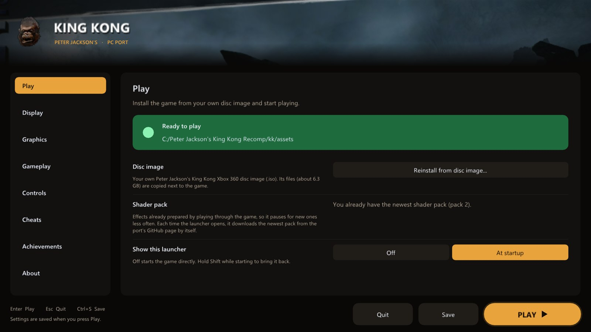</td>
<td valign="middle">

### Play
- **Install the game** straight from your disc image, with a progress bar
- Checks the disc really is King Kong
- **Shader pack** download: every effect already prepared, so the game never pauses for a new one
- **Share my shaders**: help the next players by sharing the effects your play-through prepared
- **Updates**: the launcher tells you when a new version is out and installs it with one click
- Turn the launcher off and **hold Shift** at start to bring it back

</td>
</tr>
<tr>
<td valign="middle">

### Display
- **Windowed** or **fullscreen**
- **Window size** that fits your screen
- **Choose the monitor**
- **VSync** on or off (off works great with G-Sync and FreeSync)
- **Keep 16:9** with borders, or **stretch** to fill

</td>
<td width="55%">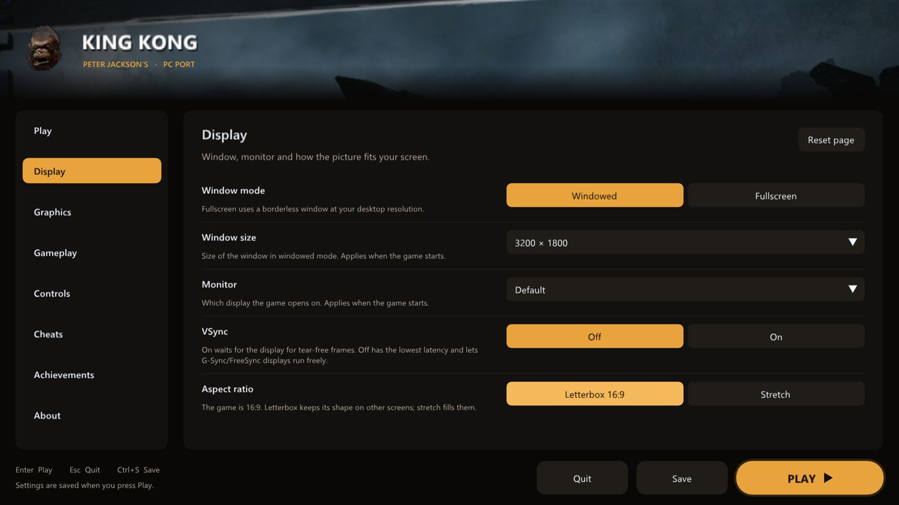</td>
</tr>
<tr>
<td>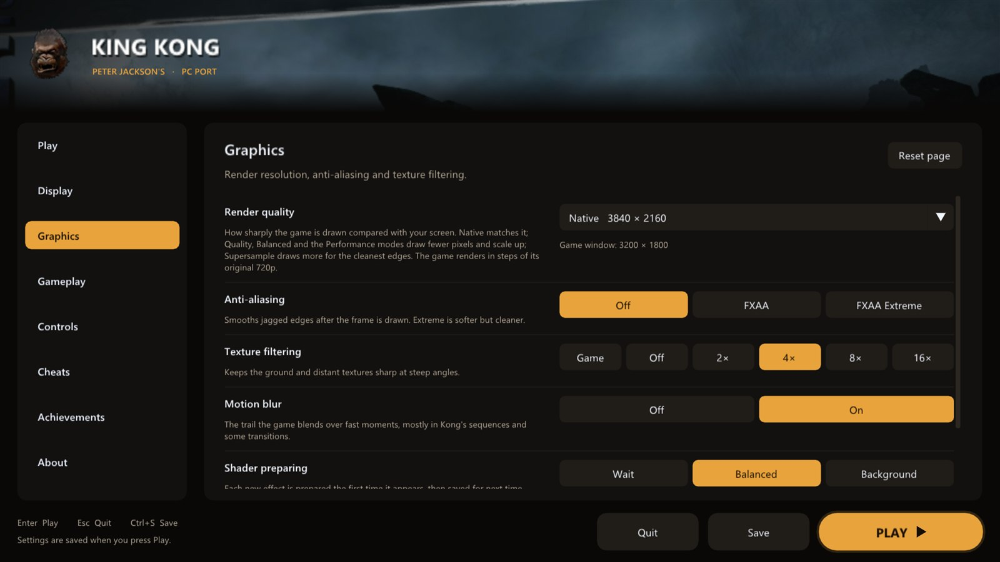</td>
<td valign="middle">

### Graphics
- **Render quality** presets: Supersample, Native, Quality, Balanced, Performance and Ultra Performance, each showing the real resolution
- **Custom resolution** from 1x (720p) to 6x (8K)
- **FXAA** and **FXAA Extreme**
- **Texture filtering** up to 16x
- **Motion blur** on or off: Off removes the ghost trail the game blends over fast moments, mostly in Kong's sequences
- **Shader preparing**: Balanced (default: new effects are prepared on many threads at once, with a moment's wait for them, so no long pauses), Wait (always drawn right, can pause) or Background (never waits)

</td>
</tr>
<tr>
<td valign="middle">

### Gameplay
- **Frame rate**: 30 (default, like the console), 60, 90, 120, 144, 165, 240 or unlimited
- **Field of view** from 69° (the original) to 110°. The game draws the wider area too, Jack's gun keeps its usual size, and the menus keep their original look
- **Frame counter** in the corner, toggled with <kbd>F2</kbd>
- **Startup logos**: play or skip the Ubisoft, Universal and WingNut movies, straight to the title screen
- **Language**

</td>
<td>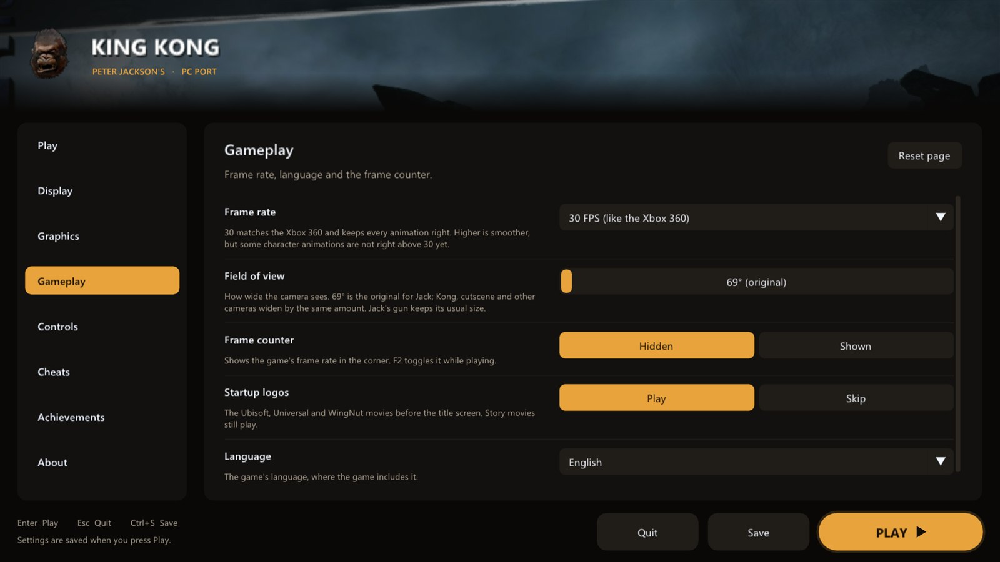</td>
</tr>
<tr>
<td>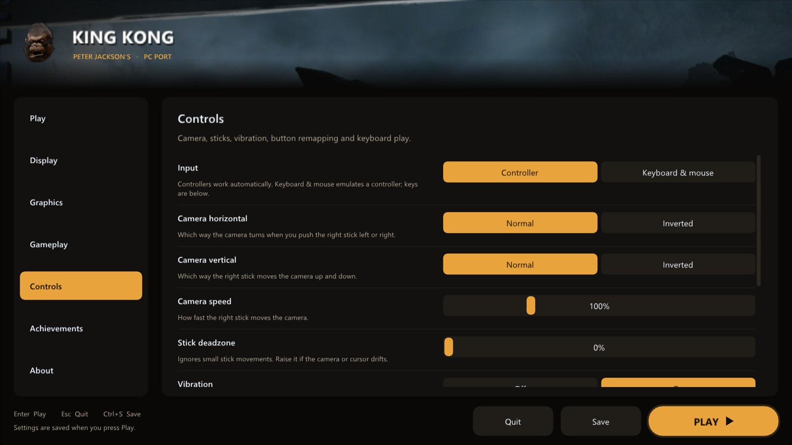</td>
<td valign="middle">

### Controls
- **Invert the camera** left/right and up/down, separately
- **Controller sensitivity** from 25% to 300%, for looking left and right and up and down
- **Camera response**: Modern turns the camera the same way in every direction; Original is the Xbox 360's own feel
- **Mouse sensitivity** and **mouse camera** for keyboard and mouse
- **Toggle aim**: press the left trigger once to raise the gun and again to lower it, instead of holding it
- **Stick deadzone** to stop drift
- **Vibration** on or off, with a strength slider
- **Remap any button** on your controller
- **Keyboard and mouse** play: click a control, press a key
- **Button prompts** for Xbox 360, Xbox Series, PlayStation 5, PlayStation 2 or your keyboard keys

</td>
</tr>
<tr>
<td valign="middle">

### Cheats
The game's own cheats, as switches instead of codes to type each time you play:
- **All chapters** and **all bonus content**
- **Fast healing**, **one-hit kills**, **999 bullets** and **unlimited spears**
- The **revolver**, **machine gun**, **shotgun** and **sniper rifle**

They switch on as soon as the game reaches its main menu, exactly as if you had typed their codes.

</td>
<td>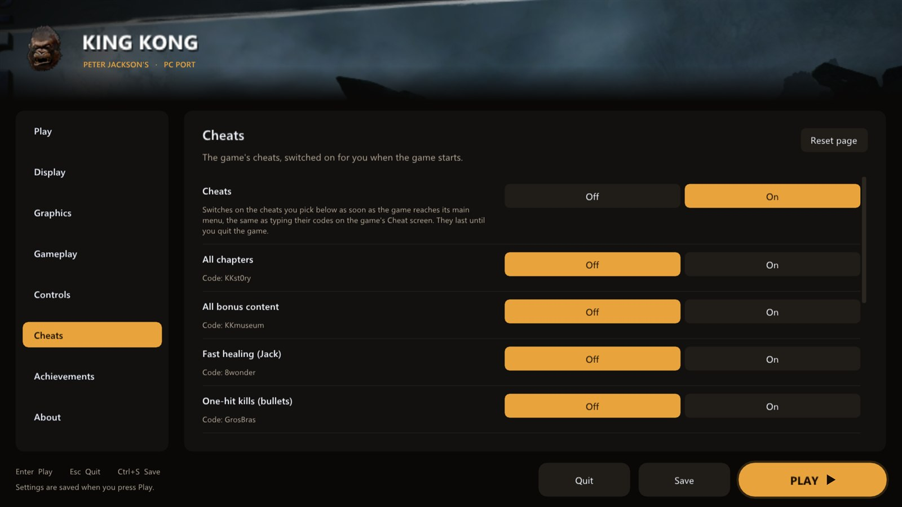</td>
</tr>
<tr>
<td>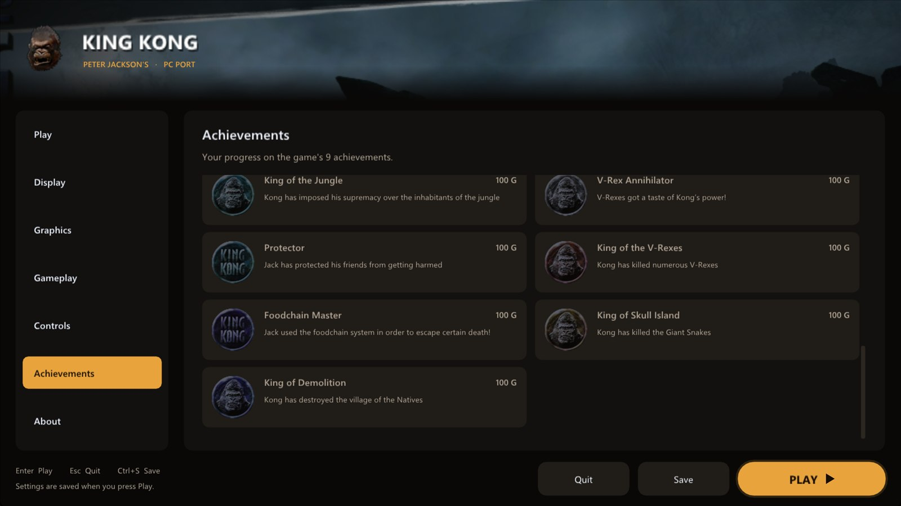</td>
<td valign="middle">

### Achievements
- All **9 achievements** with their pictures, descriptions and gamerscore
- See which ones you have **unlocked**
- Turn **pop-ups** and their **sound** on or off, set the volume
- **Pick the sound**: the built-in chime or any `.wav` you put in the `sounds` folder
- A **test button** to see and hear it
- A bonus **Welcome to Skull Island** achievement the first time you play

</td>
</tr>
<tr>
<td valign="middle">

### About
- Open your **save folder**, **game folder** or **settings file** in one click
- **Reset** every setting
- Refresh the launcher's art from the game's menu
- **Check for updates** now, or turn the check at start off
- The **changelog**: the notes for every version

</td>
<td>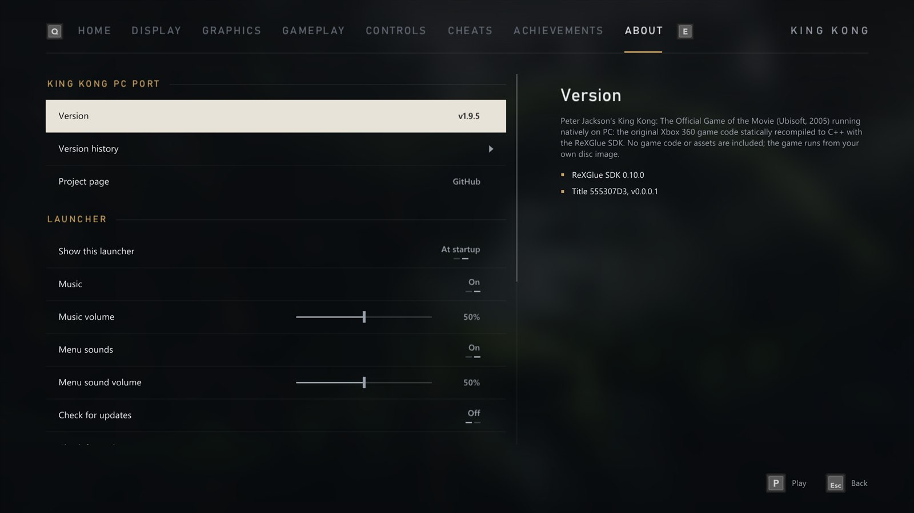</td>
</tr>
<tr>
<td>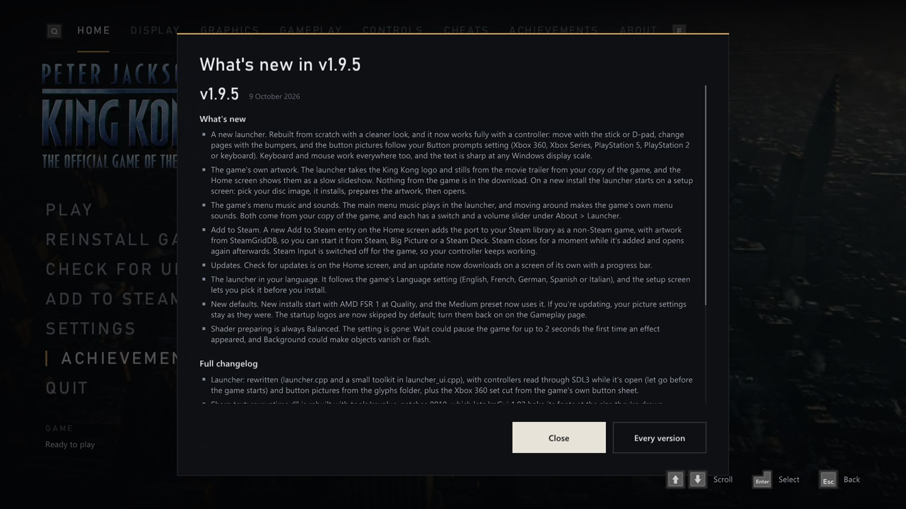</td>
<td valign="middle">

### What's new
- After an update, the launcher shows **what changed** the first time it opens
- **Every version** takes you to the full changelog on the About page

</td>
</tr>
</table>

## In game

<div align="center">
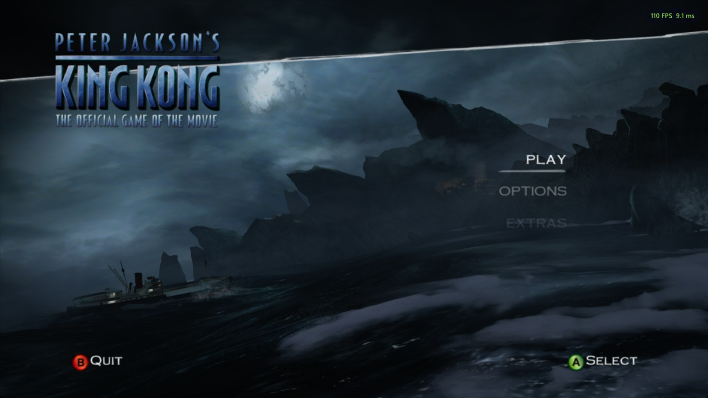
<sub>The main menu.</sub>
</div>

<br>

<table>
<tr>
<td width="50%">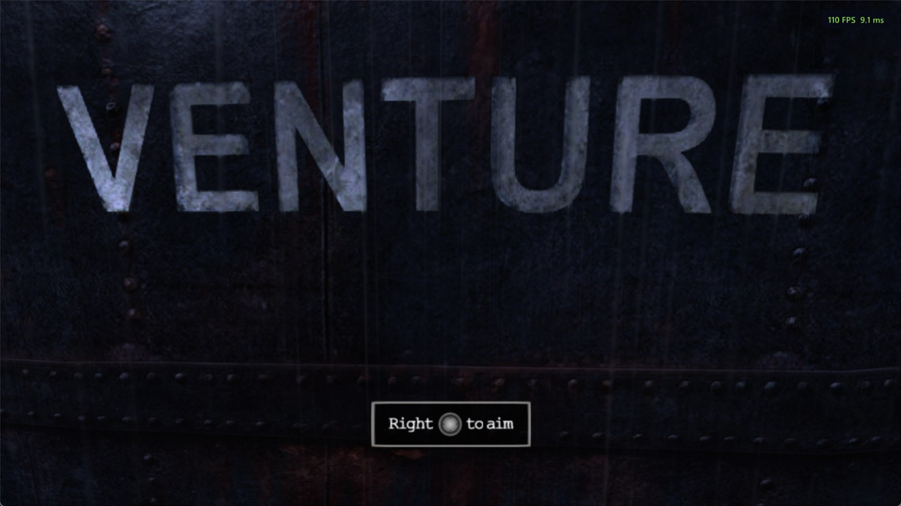</td>
<td width="50%">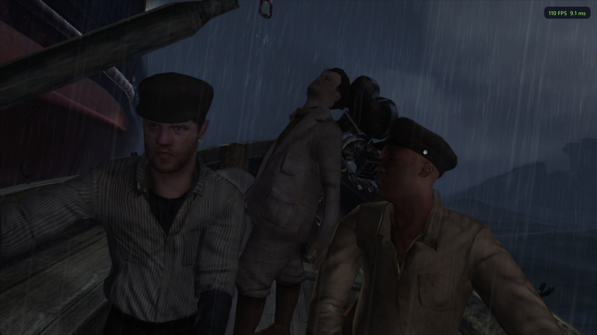</td>
</tr>
<tr>
<td>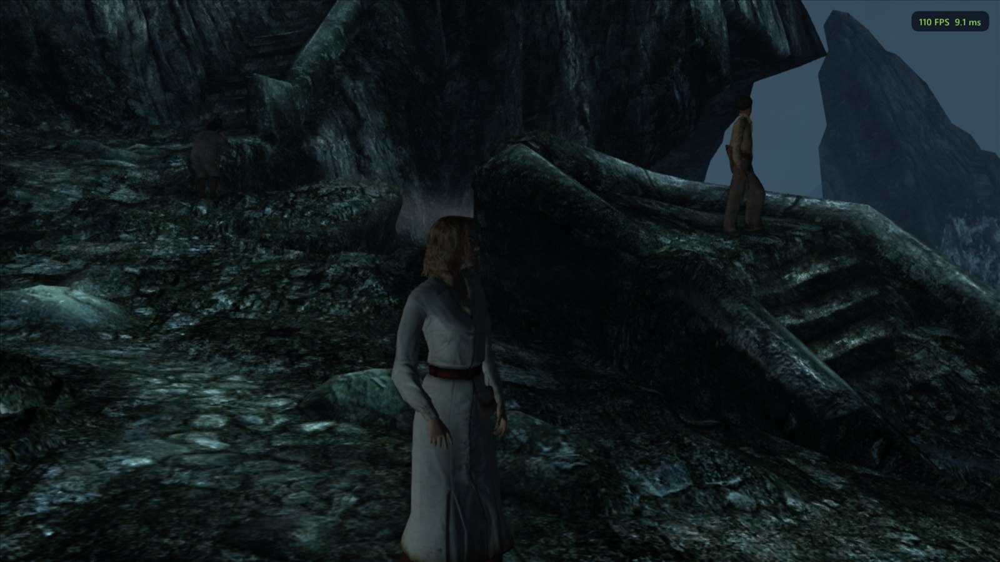</td>
<td>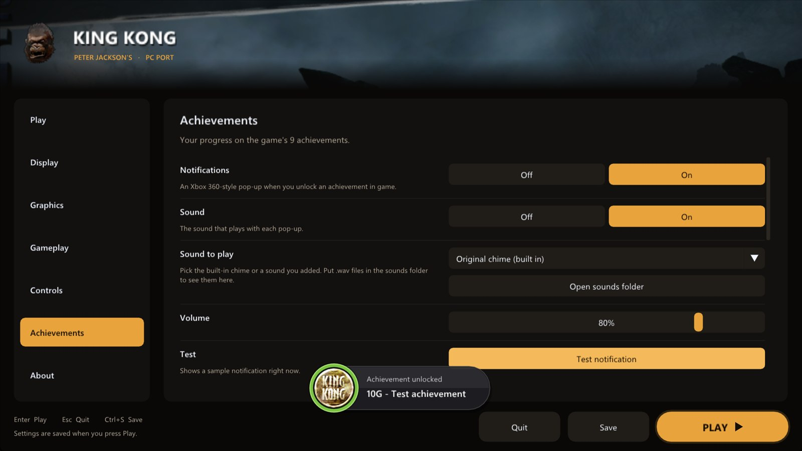</td>
</tr>
</table>

### Xbox 360 vs PC port

| | Xbox 360 | PC port |
| --- | :---: | :---: |
| Resolution | 1280 x 720 | up to 7680 x 4320 |
| Frame rate | 30 fps | 30 fps, or up to 240 and unlimited |
| Anti-aliasing | console (2x MSAA) | console 2x MSAA plus FXAA, or higher resolutions |
| Texture filtering | console | up to 16x |
| Display | TV | windowed or fullscreen, any monitor |
| Controls | Xbox 360 controller | any controller, remapping, keyboard and mouse |
| Camera | game options | field of view, inverted axes, sensitivity, deadzone |
| Motion blur | always on | on or off |
| Startup logos | always play | play or skip |
| Cheats | typed as codes each time | switches in the launcher |
| Achievement pop-ups | console | Xbox 360 style, with your choice of sound |

### Hotkeys

| Key | Action |
| --- | --- |
| <kbd>F2</kbd> | frame counter |
| <kbd>F3</kbd> | performance overlay |
| <kbd>F7</kbd> | achievements overlay |
| <kbd>Shift</kbd> while starting | open the launcher |

### Known issues

- Above 30 fps some character animations are not right yet. For example, the crew rowing at the start skip part of their animation. 30 fps, the default, plays them correctly.
- There can be a short pause when the game loads the next area. The game does the same on the Xbox 360.
- The pre-rendered videos pause for a moment every couple of seconds while the video player keeps to the video's timing. This is being looked into.
- The first time you see a new effect it has to be prepared. With **Graphics > Shader preparing** on Balanced (the default), many are prepared at once in the background and the game waits only a moment for them, so there are no long pauses, but an object can occasionally appear a moment late the first time. Effects are saved, so this only happens once, and the **shader pack** on the launcher's Play page prepares the effects other players have already seen before you play.

### The shader pack

The game prepares each new effect (a shader) the first time it appears, which can cause a short pause. The shader pack is the list of effects collected by a test build that plays every chapter on its own, published on the [shader-packs release](https://github.com/TekRantGaming/king-kong-recompiled/releases/tag/shader-packs). Click **Download shader pack** on the launcher's Play page and it is added to your shader cache (`Documents\king_kong\cache`), keeping anything your game has already prepared. Each time the game starts it prepares everything in the cache, so you get no pauses even on a first play-through. New packs come out as more of the game is covered: when one does, the launcher offers it when it opens (see **Updates**).

### Share my shaders

The shader pack only covers what has been played so far, and that is where you can help. Once you have played a good
part of the game, open the launcher's **Play** page and click **Share my shaders**. It packs your shaders into one small
`shader-share-....zip` file in `Documents\king_kong`, shows it to you, and opens a
[Share shaders](https://github.com/TekRantGaming/king-kong-recompiled/issues/new?template=share-shaders.yml) form on
GitHub to drop it into (you need a free GitHub account). The file holds only shader data: nothing personal, no saves or
settings. Shaders that at least two players have sent go into the next shader pack.

### Updates

When the launcher opens it asks GitHub whether a newer version of the port, or a newer shader pack, is out. They come
out separately and each one is offered on its own. For the port, **Update now** downloads it, replaces the port's own
files and restarts the launcher; your installed game, saves and settings stay as they are. For the shader pack,
**Download now** adds it to the shaders your game has already prepared. Turn the checks off on the **About** page.

### Reporting a problem

Everything useful is in the `logs` folder next to `king_kong.exe`:

- `king_kong.log` describes your settings, and every 10 seconds it notes the frame rate, the 1% low and any frames that took over 50 or 100 ms. That shows exactly where stutter happens.
- If the game crashes, `crash-<date>.txt` and `crash-<date>.dmp` appear next to it.

Please attach them to an [issue](https://github.com/TekRantGaming/king-kong-recompiled/issues) together with your CPU, graphics card and the resolution you play at.

## Which version you need

The port is made for this disc only. Other versions will not work.

| | |
| --- | --- |
| Game | Peter Jackson's King Kong: The Official Game of the Movie |
| Disc | Xbox 360, USA and Europe (English, French, German, Spanish, Italian, Dutch, Swedish, Norwegian, Danish, Finnish) |
| Title ID | `555307D3` |
| Game version | `0.0.0.1` (the original disc release) |
| Disc image | `.iso`, 7,834,892,288 bytes |
| SHA-1 | `075F43709E9C9A095E099AB5056CC04B768288D1` |
| MD5 | `35D671ED4E9EAD9E6B288A3441B6C8F9` |

The launcher checks the title ID before it installs. To check your disc image yourself, run this in PowerShell and compare the result with the SHA-1 above:

```powershell
Get-FileHash "C:\Games\King Kong.iso" -Algorithm SHA1
```

## Getting started

**You need:** Windows 10 or 11 (64-bit), a graphics card with DirectX 12, about 7 GB of free space, and your own Peter Jackson's King Kong Xbox 360 disc as a disc image (see [Which version you need](#which-version-you-need)).

1. Download the **KingKong-...-windows-x64.zip** file from the [latest release](https://github.com/TekRantGaming/king-kong-recompiled/releases/latest) and unzip it anywhere.
2. Run **king_kong.exe**. The launcher opens.
3. Click **Install from disc image...** and pick your King Kong disc image. The launcher checks it and copies the game files (about 6.3 GB) into a `game` folder next to the exe.
4. Press **PLAY**.

The download contains only this port. **No game files are included**: they come from your own disc. Your saves and settings are kept in `Documents\king_kong`.

**Linux:** in development. A Linux version is being worked on but is not ready yet, so there is no Linux download for now.

<details>
<summary><b>Building from source (for developers)</b></summary>

You need Visual Studio 2022 Build Tools with Clang, CMake and Ninja.

```powershell
.\setup.ps1 -Iso "C:\Games\King Kong.iso"   # downloads the SDK, unpacks your disc, translates the code
kk\build.bat kk-release                      # compiles
```

The finished game is in `kk\out\build\kk-release`. `Build King Kong.bat` does all of this in one go and puts the result in a `KingKong` folder. Point the game at your files with `--game_data_root`, or keep them in a `game` folder next to the exe.

For testing, `kk\build.bat kk-dev` builds a version with developer aids that release builds leave out. Set `KK_DEV_AUTOSKIP=1` and it presses through the intros, menus and story videos into gameplay on its own, logging `KK dev: gameplay reached`. Add `KK_DEV_WANDER=1` to keep walking and looking around after that. The shader pack is built by running every chapter this way with its own `--cache_root`, then `python tools/make_shader_pack.py <version> <out> <cache folders...>`.

</details>

## The "VENTURE" freeze

On Xenia this game gets stuck at the start, looking at the ship's name "VENTURE" ([xenia-project/game-compatibility#1302](https://github.com/xenia-project/game-compatibility/issues/1302)). The cause is how disc reads finish. The game streams music and voice lines with reads it expects to finish right away. The emulator finishes them but reports them as still in progress, so the game thinks it got no data. No voice line ever plays, and the opening waits forever for one to end.

This port finishes those reads the way the console does (`kk/src/io_fix.cpp`), so music, voice lines and the opening all work.

## Credits

- **Peter Jackson's King Kong: The Official Game of the Movie** by Ubisoft Montpellier, published by Ubisoft in 2005.
- Button prompt pictures from [**Xelu's Free Controllers & Keyboard Prompts**](https://thoseawesomeguys.com/prompts/) (CC0).
- [**ReXGlue SDK**](https://github.com/rexglue/rexglue-sdk), which does the code translation and runs the game, built on the work of [**Xenia**](https://github.com/xenia-project/xenia) and [**XenonRecomp**](https://github.com/hedge-dev/XenonRecomp).

> [!NOTE]
> **AI disclosure:** this port was made almost entirely with Claude Code (Anthropic). The repository owner directed and tested the work; the AI did the analysis, code, tools and documentation.

> [!IMPORTANT]
> This project is not affiliated with or endorsed by Ubisoft, Universal Studios, WingNut Films, Microsoft or Xbox. It contains no game code or assets (the button prompt pictures are free CC0 art, not taken from the game). Do not open issues asking for game files.
